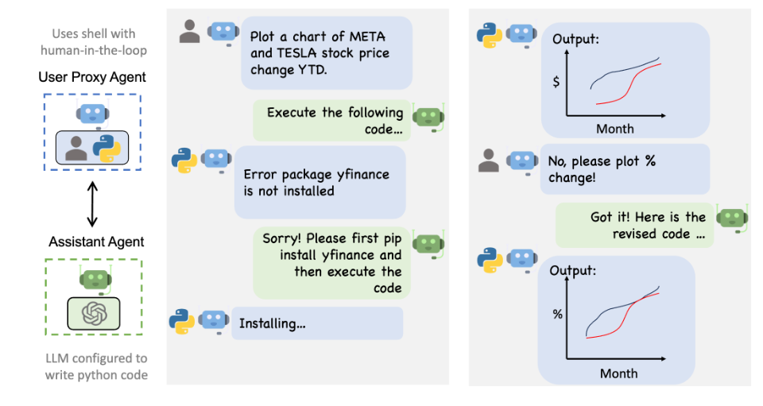

# Cyprus Codes Self-Hosted LLM with AutoGen Agents and Function Calling

This repository hosts a self-contained inference server for any open-source Large Language Model (LLM). It offers an OpenAI API-compatible server, along with AutoGen agents capable of advanced function calling.

## Getting Started

### Prerequisites:
- Unix-based system for Ollama installation.
- Python environment.

### Installation:

1. **Clone the Repository:**
   ```bash
   git clone git@github.com:Jawabreh0/CyprusCodes_LLM.git
   ```

2. **Install Dependencies:**
   ```bash
   pip install -r requirements.txt
   ```

3. **Install Ollama (Unix Only):**
   [Ollama Installation Guide](https://ollama.ai/)

4. **Install a Preferred LLM (e.g., Mistral 7B):**
   [Mistral 7B Installation](https://ollama.ai/library/openhermes:7b-mistral-v2.5-q5_K_M)

5. **Configure LLM Path:**
   Update the LLM path in `/CyprusCodes_LLM/inference_server/conversation.py` (Line No. 18).

6. **Start the Server:**
   ```bash
   python /CyprusCodes_LLM/inference_server/main.py
   ```

7. **Access Server Documentation:**
   [Server API Documentation](http://0.0.0.0:8000/docs)

8. **Load the Model:**
   Make request to load the model using the command in `/CyprusCodes_LLM/inference_server/load-model-command.txt`, but make sure to change the model path

9. **Make Conversation With The LLM Without Function Calling:**
   ```bash
   python /CyprusCodes_LLM/inference_server/conversation.py
   ```

10. **Conversation With Function Calling:**
    ```bash
    python /CyprusCodes_LLM/agents_and_function_calling/main.py
    ```

11. **Customize External System Adaptor:**
    Modify `/CyprusCodes_LLM/agents_and_function_calling/flight_adaptor.py` for specific use cases.

12. **Tailor Agent Scripts:**
    Update `agent_engineer.py` and `agent_expert.py` as per your system adaptor requirements.

## How It Works:

- **Adaptor**: An abstraction layer for external systems, e.g., fetching data from `flight_data.json`.
- **Agent_Engineer**: Defines the functions to be executed, including their JSON schema signatures and system messages.
- **Agent_Expert**: Determines the values to be passed into functions.
- **Agent_User**: Acts as a proxy for user interactions.
- **Agent_Utils**: Manages termination protocols.

## Limitations:
AutoGen provides multi-agent conversation framework as a high-level abstraction. With this framework, one can conveniently build LLM workflows, AutoGen offers a collection of working systems spanning a wide range of applications from various domains and complexities, AutoGen supports enhanced LLM inference APIs, which can be used to improve inference performance and reduce cost.

But, AutoGen supports only OpenAI API, so we have to make sure that our inference server compatabile with OpenAI API

## How It Works ?:
Autogen enables the next-gen LLM applications with a generic multi-agent conversation framework. It offers customizable and conversable agents which integrate LLMs, tools, and humans. By automating chat among multiple capable agents, one can easily make them collectively perform tasks autonomously or with human feedback.


